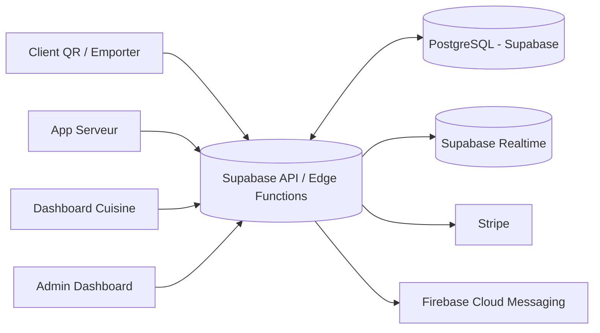

# Architecture

## Vue d’ensemble

## Composants
- **DB**: Postgres (Supabase) – tables, RLS, vues pour stats.
- **Auth**: Supabase Auth (roles staff/admin), session JWT.
- **Realtime**: channels pour `orders` & `order_items`.
- **Fronts**:
  - Web Client (Next.js)
  - Staff App (Expo/React Native ou Next.js tablettes)
  - KDS (React Web)
  - Admin (React Web)
- **Paiement**: Stripe Checkout + webhooks.
- **Notifications**: FCM (topics par table/commande).

## Sécurité
- RLS stricte (voir `SECURITY.md`).
- Différencier “public” (lecture menu) et “staff” (CRUD).
